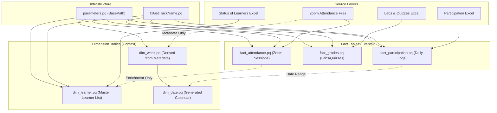

# Power Query Architecture: Dare Careers Dashboard

## Overview

This directory contains the **Optimized Power Query (M-Code)** solution for the Dare Careers Power BI Dashboard. The architecture has been refactored to ensure high performance, scalability, and ease of maintenance.

---

## 🏗️ Architecture Diagram

The system follows a **Metadata-Driven** approach for the Calendar and a **Decoupled** approach for Learners, ensuring robustness even if data is missing or files are moved.

---

## � Detailed Data Lineage & Logic

This section explains exactly how each table is populated based on the current M-Code.

### 1. Infrastructure

- **`parameters.pq`**: Defines the `BasePath`.
  - _Logic_: Hardcoded text string pointing to the Data directory. All other queries reference this.
- **`fxGetTrackName.pq`**: Helper function.
  - _Logic_: Takes a folder path. Finds the "Data" folder (case-insensitive) and extracts the _next_ folder name (e.g., `...\Data\AWSCloud Training\...` -> returns `AWSCloud`).

### 2. Dimension Tables

- **`dim_week.pq`**: The "Program Schedule".
  - _Source_: Folder **Metadata** only (filenames/folder names).
  - _Logic_: Scans `Zoom Attendance` folders. Extracts Week Number from folder name ("Week 1") and Date from filename ("2024-08-05.csv").
  - _Aggregation_: Groups by Week Number to find the Min (Start) and Max (End) date for that week.
  - _Performance_: Extremely fast because it never opens the actual CSV files.

- **`dim_date.pq`**: The "Master Calendar".
  - _Source_: `dim_week` and `fact_participation`.
  - _Logic_:
    1.  Gets the Program Start/End dates from `dim_week`.
    2.  Gets the Actual Activity Start/End dates from `fact_participation`.
    3.  Generates a continuous list of dates covering the full range of both.
    4.  Adds standard attributes (Year, Month, Day, DayOfWeek, IsWeekend).

- **`dim_learner.pq`**: The "Master Student List".
  - _Source_: `Status of Learners` Excel files + `fact_attendance`.
  - _Logic_:
    1.  Loads all learners from the Status files (Enrollment List).
    2.  **Enrichment**: Left Joins with `fact_attendance` to find the learner's Name (since Status files only have Email) and Enrollment Date (First Attendance).
    3.  **Fallback**: If a learner has no attendance (Name is null), creates a "Derived Name" by formatting the email address (e.g., `john.doe@...` -> "John Doe").
    4.  **Status**: Calculates `current_status` (Graduate, Certified, In Progress) based on Excel status columns.

### 3. Fact Tables

- **`fact_attendance.pq`**: Zoom Session Records.
  - _Source_: Recursive scan of all CSVs in `Zoom Attendance`.
  - _Logic_:
    1.  Extracts Date from filename and Week from folder path.
    2.  Parses `Duration`: Handles both "Total Minutes" (e.g., `66`) and "Time" (e.g., `1:06:00`) formats.
    3.  Calculates `is_attended` flag (1 if duration > 30 mins, else 0).
    4.  Links to `dim_learner` via Email.

- **`fact_grades.pq`**: Lab and Quiz Scores.
  - _Source_: `Labs & Quizzes` Excel files.
  - _Logic_:
    1.  Filters for "Labs" and "Quizzes" sheets.
    2.  **Unpivots** the data: Turns horizontal columns ("Week 1", "Week 2"...) into vertical rows.
    3.  Extracts numeric Week Number from the header text.

- **`fact_participation.pq`**: Daily participation logs.
  - _Source_: `Participation` Excel files.
  - _Logic_:
    1.  Splits the comma-separated `Participants` column into multiple rows (one per student).
    2.  Parses the Date.
    3.  **Mapping**: Merges with `fact_attendance` to find the Email Address for each Name (since Participation logs often lack emails).

---

## � Setup Guide

### 1. Prerequisites

Before pasting any query code, you must create the foundational elements that other queries depend on.

- **Step A: Define the Base Path**
  1.  Create a **New Blank Query** in Power Query Editor.
  2.  Name it `BasePath`.
  3.  Paste the code from `parameters.pq`.
  4.  **Crucial**: Update the path string inside to valid location of your `Data` folder.

- **Step B: Add the Helper Function**
  1.  Create a **New Blank Query**.
  2.  Name it `fxGetTrackName`.
  3.  Paste the code from `fx_get_track_name.pq`.

### 2. Implementation

Copy/paste the code from the respective `.pq` files into blank queries with the exact same names.

# Power Query Architecture: Dare Careers Dashboard

## Overview

This directory contains the **Optimized Power Query (M-Code)** solution for the Dare Careers Power BI Dashboard. The architecture has been refactored to ensure high performance, scalability, and ease of maintenance.

---

## 🏗️ Architecture Diagram

The system follows a **Metadata-Driven** approach for the Calendar and a **Decoupled** approach for Learners, ensuring robustness even if data is missing or files are moved.

---

## � Detailed Data Lineage & Logic

This section explains exactly how each table is populated based on the current M-Code.

### 1. Infrastructure

- **`parameters.pq`**: Defines the `BasePath`.
  - _Logic_: Hardcoded text string pointing to the Data directory. All other queries reference this.
- **`fxGetTrackName.pq`**: Helper function.
  - _Logic_: Takes a folder path. Finds the "Data" folder (case-insensitive) and extracts the _next_ folder name (e.g., `...\Data\AWSCloud Training\...` -> returns `AWSCloud`).

### 2. Dimension Tables

- **`dim_week.pq`**: The "Program Schedule".
  - _Source_: Folder **Metadata** only (filenames/folder names).
  - _Logic_: Scans `Zoom Attendance` folders. Extracts Week Number from folder name ("Week 1") and Date from filename ("2024-08-05.csv").
  - _Aggregation_: Groups by Week Number to find the Min (Start) and Max (End) date for that week.
  - _Performance_: Extremely fast because it never opens the actual CSV files.

- **`dim_date.pq`**: The "Master Calendar".
  - _Source_: `dim_week` and `fact_participation`.
  - _Logic_:
    1.  Gets the Program Start/End dates from `dim_week`.
    2.  Gets the Actual Activity Start/End dates from `fact_participation`.
    3.  Generates a continuous list of dates covering the full range of both.
    4.  Adds standard attributes (Year, Month, Day, DayOfWeek, IsWeekend).

- **`dim_learner.pq`**: The "Master Student List".
  - _Source_: `Status of Learners` Excel files + `fact_attendance`.
  - _Logic_:
    1.  Loads all learners from the Status files (Enrollment List).
    2.  **Enrichment**: Left Joins with `fact_attendance` to find the learner's Name (since Status files only have Email) and Enrollment Date (First Attendance).
    3.  **Fallback**: If a learner has no attendance (Name is null), creates a "Derived Name" by formatting the email address (e.g., `john.doe@...` -> "John Doe").
    4.  **Status**: Calculates `current_status` (Graduate, Certified, In Progress) based on Excel status columns.

### 3. Fact Tables

- **`fact_attendance.pq`**: Zoom Session Records.
  - _Source_: Recursive scan of all CSVs in `Zoom Attendance`.
  - _Logic_:
    1.  Extracts Date from filename and Week from folder path.
    2.  Parses `Duration`: Handles both "Total Minutes" (e.g., `66`) and "Time" (e.g., `1:06:00`) formats.
    3.  Calculates `is_attended` flag (1 if duration > 30 mins, else 0).
    4.  Links to `dim_learner` via Email.

- **`fact_grades.pq`**: Lab and Quiz Scores.
  - _Source_: `Labs & Quizzes` Excel files.
  - _Logic_:
    1.  Filters for "Labs" and "Quizzes" sheets.
    2.  **Unpivots** the data: Turns horizontal columns ("Week 1", "Week 2"...) into vertical rows.
    3.  Extracts numeric Week Number from the header text.

- **`fact_participation.pq`**: Daily participation logs.
  - _Source_: `Participation` Excel files.
  - _Logic_:
    1.  Splits the comma-separated `Participants` column into multiple rows (one per student).
    2.  Parses the Date.
    3.  **Mapping**: Merges with `fact_attendance` to find the Email Address for each Name (since Participation logs often lack emails).

---

## � Setup Guide

### 1. Prerequisites

Before pasting any query code, you must create the foundational elements that other queries depend on.

- **Step A: Define the Base Path**
  1.  Create a **New Blank Query** in Power Query Editor.
  2.  Name it `BasePath`.
  3.  Paste the code from `parameters.pq`.
  4.  **Crucial**: Update the path string inside to valid location of your `Data` folder.

- **Step B: Add the Helper Function**
  1.  Create a **New Blank Query**.
  2.  Name it `fxGetTrackName`.
  3.  Paste the code from `fx_get_track_name.pq`.

### 2. Implementation

Copy/paste the code from the respective `.pq` files into blank queries with the exact same names.
