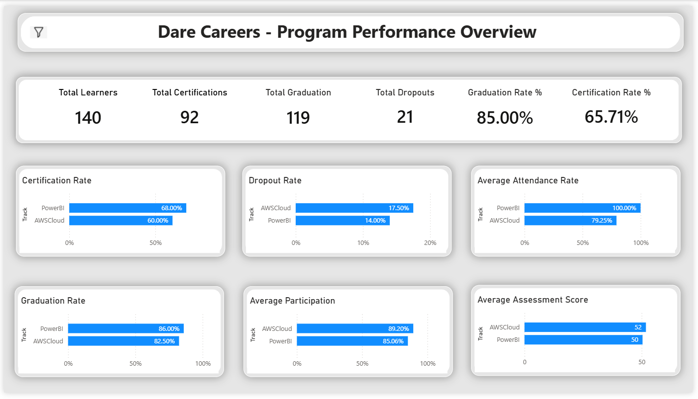
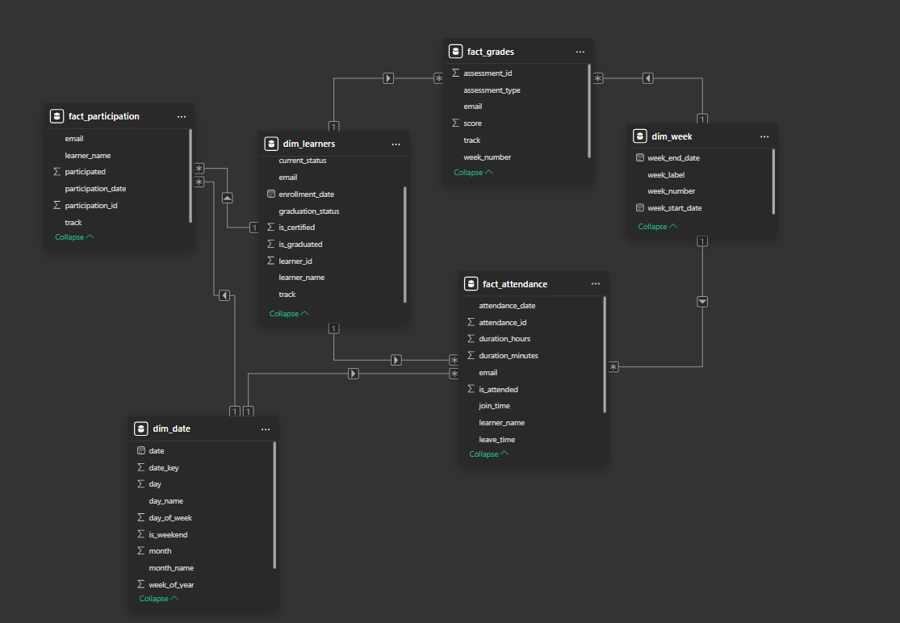

# Dare Careers Student Progress Dashboard

A comprehensive Power BI dashboard designed to track student progress, engagement, and success rates for the Dare Careers program.

## Table of Contents

- [Overview](#overview)
- [Key Features](#key-features)
- [Data Architecture](#data-architecture)
- [Project Structure](#project-structure)
- [Getting Started](#getting-started)
- [Report Pages](#report-pages)

## Overview

This dashboard consolidates data from multiple sources (Zoom attendance, Labs/Quizzes, Participation logs, and Enrollment status) into a unified view. It enables program managers and trainers to:

- Monitor program health (Graduation Rates, Certification Rates).
- Identify at-risk learners early.
- Drill down into specific learner details.

## Key Features

- **Automated Data Processing**: Uses advanced Power Query (M-Code) for robust ETL.
- **Dynamic Date Intelligence**: Custom `dim_date` and `dim_week` tables.
- **Learner Insights**: Detailed metrics including Attendance %, Lab Scores, and Participation.
- **Interactive Visuals**: Slicers for Cohort, Track, and Status filtering.

## Data Architecture

The project follows a **Star Schema** data model for optimal performance:

### Dimension Tables

- **`dim_learner`**: Master list of students with enrollment status.
- **`dim_date`**: Calendar table for time-based analysis.
- **`dim_week`**: Program schedule derived from folder structures.

### Fact Tables

- **`fact_attendance`**: Granular Zoom session logs.
- **`fact_grades`**: Lab and Quiz scores.
- **`fact_participation`**: Daily participation activities.

For detailed documentation on the Power Query logic, see [powerquery/README.md](powerquery/README.md).

## Project Structure

- `powerquery/`: Contains documentation and M-code scripts for ETL.
- `instructions.txt`: Original project requirements.

## Getting Started

1. **Prerequisites**: Ensure you have Power BI Desktop installed.
2. **Data Source**: Place raw data files in the configured `Data` directory.
3. **Refresh**: Open the `.pbix` file and click **Refresh** to load the latest data.

## Report Pages

1. **Overall Performance Metrics**: High-level program KPIs (Graduation Rate, Certification Rate).
2. **Detailed Learner Insights**: Matrix view for individual student performance tracking.
