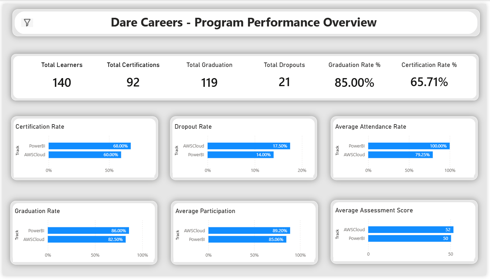
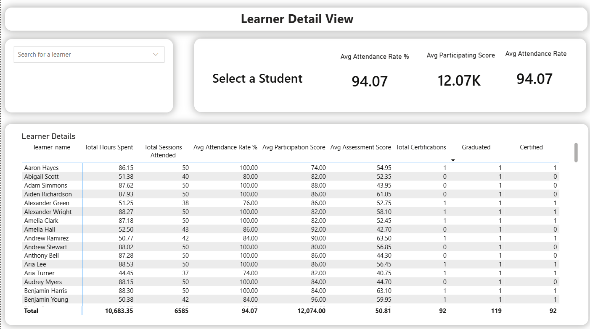

# Dare Careers Student Progress Dashboard

A comprehensive Power BI solution designed to track student progress, engagement, and success rates for the Dare Careers program. This dashboard empowers program managers to identify at-risk learners, monitor cohort performance, and ensure high graduation rates.

---

## Getting Started

### 1. Prerequisites

- **Power BI Desktop**: Download and install the latest version from the [Microsoft Store](https://aka.ms/pbidesktopstore) or [web](https://powerbi.microsoft.com/desktop/).
- **Data Source**: This dashboard connects to a local `Data` folder containing Zoom attendance, Grades, and Participation logs.

### 2. Installation & Setup

1.  Clone or download this repository.
2.  Ensure your data files are organized in the `Data` directory as expected by the Power Query logic.
3.  Open `Power-BI.pbix` in Power BI Desktop.
4.  **Refresh Data**: Click the **Refresh** button in the Home ribbon to load the latest data from your local files.

---

## Dashboard Overview

The report consists of two main pages designed for different levels of analysis.

### 1. Overall Performance Metrics

**Goal**: High-level summary of program health for stakeholders.

**Key Metrics & Visuals**:

**1. Bar Charts:**

- **Graduation Rates**: Percentage of learners who graduated from each cohort.
- **Certification Rates**: Percentage of learners who achieved certification.
- **Dropout Rates**: Percentage of learners who dropped out of the program.
- **Average Attendance**: Display the average percentage of total class time attended by learners.
- **Average Participation**: Visualize the average engagement score based on daily participation.
- **Average Assessment Scores**: Show the average quiz and lab scores for each cohort.

**2. Cards (Summary Figures):**

- **Total Certifications**: Display the number of learners who achieved certification.
- **Total Learners**: Show the total number of learners enrolled across all cohorts.
- **Total Dropouts**: Count the number of learners who dropped out before completing the program.
- **Total Graduations**: Show the total number of learners who successfully graduated.

**Filters:**
Incorporate slicers to allow users to filter the data based on the following dimensions:

- **Cohort**: Choose specific cohorts to view their performance.
- **Track**: Filter by different tracks (e.g., Power BI, AWS Cloud).
- **Certification Type**: Filter by the type of certification (if applicable).
- **Learner Status**: Filter by learners who are Certified or Not Certified.

### 2. Learner Detail View

**Goal**: Granular analysis tool for trainers to monitor individual student progress.

**Features**:

- **Searchable Slicer**: Quickly find any student by typing their name in the "Search for a learner" box.
- **Student Profile**:
  - Selecting a student updates the top KPIs to show their specific **Avg Attendance Rate %**, **Participation Score**, and **Attendance Rate**.
- **Detailed Matrix**:
  - A comprehensive table listing every student with:
    - **Total Hours Spent**: Time in Zoom sessions.
    - **Total Sessions Attended**: Count of eligible sessions (>30 mins).
    - **Avg Attendance Rate %**: Visual indicator of attendance health.
    - **Avg Participation Score**: Metric of daily engagement.
    - **Avg Assessment Score**: Combined Lab and Quiz performance.
    - **Status Indicators**: "Graduated" and "Certified" flags (1/0).

---

## Project Structure

- **`Power-BI.pbix`**: The main Power BI report file.
- **`powerquery/`**: Contains the source code for the ETL logic, ensuring the data model is robust and easy to maintain.
- **`instructions.txt`**: The original requirements document defining the scope of this project.
- **`Data/`**: (Not included in repo) Local folder where raw data files should be placed.
