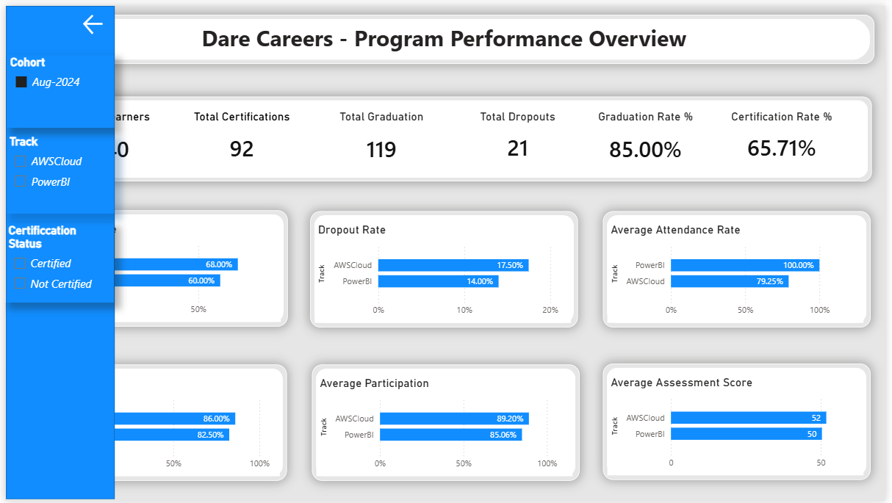
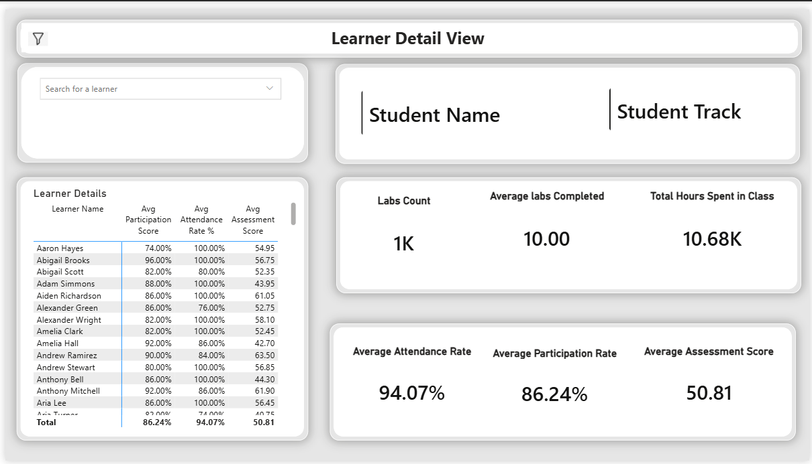
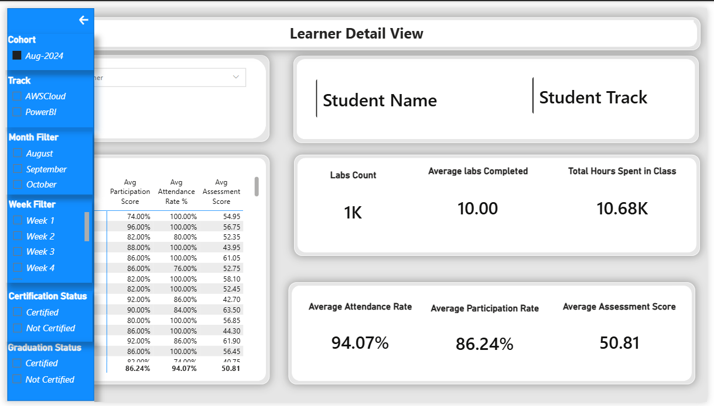
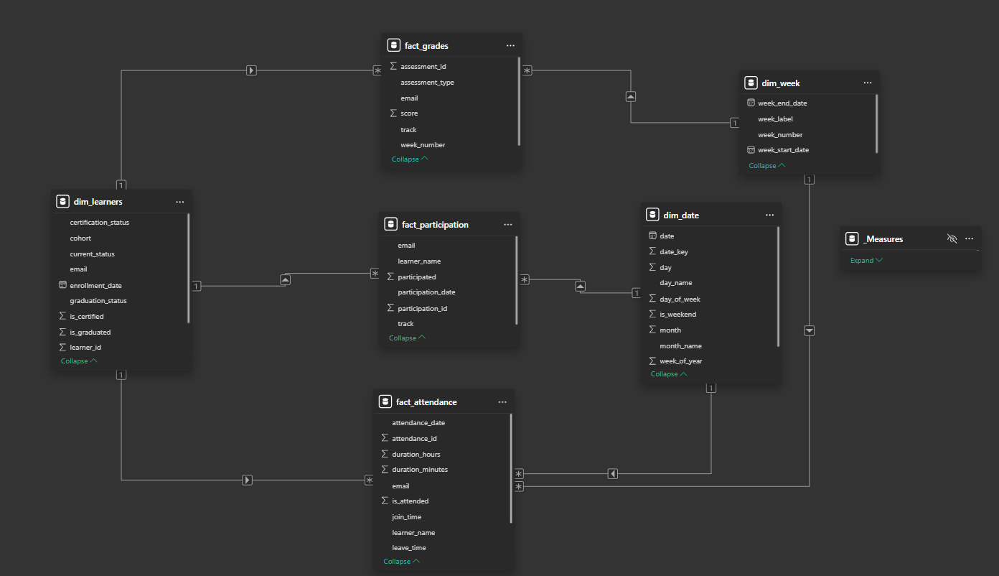

# Dare Careers Student Progress Dashboard

A comprehensive Power BI solution designed to track student progress, engagement, and success rates for the Dare Careers program. This dashboard empowers program managers to identify at-risk learners, monitor cohort performance, and ensure high graduation rates.

---

## Getting Started

### 1. Prerequisites

- **Power BI Desktop**: Download and install the latest version from the [Microsoft Store](https://aka.ms/pbidesktopstore) or [web](https://powerbi.microsoft.com/desktop/).
- **Data Source**: This dashboard connects to a local `Data` folder containing Zoom attendance, Grades, and Participation logs.

### 2. Installation & Setup

1.  Clone or download this repository.
2.  Ensure your data files are organized in the `Data` directory as expected by the Power Query logic.
3.  Open `Power-BI.pbix` in Power BI Desktop.
4.  **Refresh Data**: Click the **Refresh** button in the Home ribbon to load the latest data from your local files.

---

## Dashboard Overview

The report consists of two main pages designed for different levels of analysis.

### 1. Overall Performance Metrics

**Goal**: High-level summary of program health for stakeholders.

**Key Metrics & Visuals**:

**1. Bar Charts:**

- **Graduation Rates**: Percentage of learners who graduated from each cohort.
- **Certification Rates**: Percentage of learners who achieved certification.
- **Dropout Rates**: Percentage of learners who dropped out of the program.
- **Average Attendance**: Display the average percentage of total class time attended by learners.
- **Average Participation**: Visualize the average engagement score based on daily participation.
- **Average Assessment Scores**: Show the average quiz and lab scores for each cohort.

**2. Cards (Summary Figures):**

- **Total Certifications**: Display the number of learners who achieved certification.
- **Total Learners**: Show the total number of learners enrolled across all cohorts.
- **Total Dropouts**: Count the number of learners who dropped out before completing the program.
- **Total Graduations**: Show the total number of learners who successfully graduated.

**Filters:**
Incorporate slicers to allow users to filter the data based on the following dimensions:

- **Cohort**: Choose specific cohorts to view their performance.
- **Track**: Filter by different tracks (e.g., Power BI, AWS Cloud).
- **Certification Type**: Filter by the type of certification (if applicable).
- **Learner Status**: Filter by learners who are Certified or Not Certified.

---

### 2. Learner Detail View

**Goal**: Granular analysis tool for trainers to monitor individual student progress and identify at-risk learners.

**Filter Panel (Left Sidebar):**

| Filter                   | Options                               |
| ------------------------ | ------------------------------------- |
| **Cohort**               | Aug-2024                              |
| **Track**                | AWSCloud / PowerBI                    |
| **Month**                | August / September / October          |
| **Week**                 | Week 1 / Week 2 / Week 3 / Week 4 ... |
| **Certification Status** | Certified / Not Certified             |
| **Graduation Status**    | Certified / Not Certified             |

**Student Profile Header:**

- **Student Name** — Displays the selected learner's full name (defaults to "Student Name" when no learner is selected).
- **Student Track** — Displays the selected learner's track (defaults to "Student Track" when no learner is selected).

**Summary Cards — Row 1:**

| Card                           | Description                                           | Example Value |
| ------------------------------ | ----------------------------------------------------- | ------------- |
| **Labs Count**                 | Total number of labs completed by all learners        | 1K            |
| **Average Labs Completed**     | Average number of labs completed per learner          | 10.00         |
| **Total Hours Spent in Class** | Total hours each learner has spent attending sessions | 10.68K        |

**Summary Cards — Row 2:**

| Card                           | Description                                              | Example Value |
| ------------------------------ | -------------------------------------------------------- | ------------- |
| **Average Attendance Rate**    | The average attendance rate per learner                  | 94.07%        |
| **Average Participation Rate** | The average participation rate based on daily engagement | 86.24%        |
| **Average Assessment Score**   | Average score of all quizzes and labs per learner        | 50.81         |

**Learner Details Table:**

A comprehensive matrix listing every learner with the following columns:

- **Learner Name**: Student full name (searchable via the dropdown slicer).
- **Avg Participation Score**: Percentage of sessions in which the student actively participated.
- **Avg Attendance Rate %**: Percentage of total sessions the student attended (> 30 min threshold).
- **Avg Assessment Score**: Combined average of all Lab and Quiz scores.
- **Total Row**: Shows aggregated figures across all visible learners.

---

## Project Structure

- **`Power-BI.pbix`**: The main Power BI report file.
- **`powerquery/`**: Contains the source code for the ETL logic, ensuring the data model is robust and easy to maintain.
- **`images/`**: Screenshots of each dashboard page used in this README.
- **`instructions.txt`**: The original requirements document defining the scope of this project.
- **`Data/`**: (Not included in repo) Local folder where raw data files should be placed.

---

## Data Model

The data model follows a standard star schema with fact and dimension tables connected via surrogate keys.

