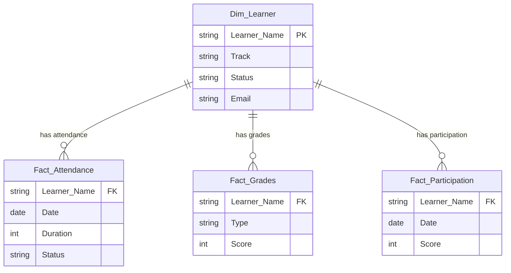

# Phase 2: Data Modeling Guide

Now that we have our data cleaned and loaded into 4 main queries (`Fact_Attendance`, `Fact_Participation`, `Fact_Grades`, `Dim_Learner`), we need to connect them.

## The Star Schema
We are building a **Star Schema** where `Dim_Learner` is the center of the universe. All other tables (Fact tables) point to it.



## Step-by-Step Modeling Instructions

### 1. Close & Apply
If you haven't already, click **Close & Apply** in Power Query to load your data into the main Power BI interface.

### 2. Verify Data Types (Critical)
Before linking, go to the **Data View** (table icon on the left) and check:
*   **Learner Name**: Must be Text in ALL tables.
*   **Date**: Must be Date (not Date/Time) in Attendance and Participation.

### 3. Create Relationships
Go to the **Model View** (diagram icon on the left).

1.  **Link Attendance**:
    *   Drag `Learner Name` from `Dim_Learner` to `Learner Name` in `Fact_Attendance`.
    *   **Relationship Type**: One-to-Many (`1:*`).
    *   **Cross-filter direction**: Single.

2.  **Link Grades**:
    *   Drag `Learner Name` from `Dim_Learner` to `Learner Name` in `Fact_Grades`.
    *   **Relationship Type**: One-to-Many (`1:*`).

3.  **Link Participation**:
    *   Drag `Learner Name` from `Dim_Learner` to `Learner Name` in `Fact_Participation`.
    *   **Relationship Type**: One-to-Many (`1:*`).

### 4. The "Date" Table (Optional but Recommended)
To analyze trends over time effectively across both Attendance and Participation, it's best practice to create a standard `Dim_Date` table.

1.  **Modeling Tab** -> **New Table**.
2.  Paste this DAX:
    ```dax
    Dim_Date = CALENDAR(DATE(2023,1,1), DATE(2023,12,31))
    ```
    *(Update the dates to cover your actual course duration).*
3.  **Link Dates**:
    *   Drag `Date` from `Dim_Date` to `Date` in `Fact_Attendance`.
    *   Drag `Date` from `Dim_Date` to `Date` in `Fact_Participation`.

## Handling "Many-to-Many" Warnings
> [!WARNING]
> If Power BI warns you about a **Many-to-Many** relationship when linking Learners, it means your `Dim_Learner` table has **Duplicates**.
>
> **Fix**: Go back to Power Query -> `Dim_Learner` query -> Select `Learner Name` column -> **Remove Duplicates**.

## Why this works
*   When you filter by "Cloud Track" (which is a column in `Dim_Learner`), it flows down to Filter `Fact_Attendance`, `Fact_Grades`, and `Fact_Participation` automatically.
*   You don't need to blend tables into one giant excel sheet. The model does the blending for you dynamically.
