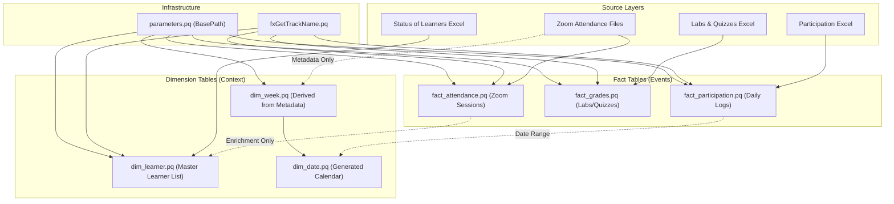

# Power Query Architecture: Dare Careers Dashboard

## Overview

This directory contains the **Optimized Power Query (M-Code)** solution for the Dare Careers Power BI Dashboard. The architecture has been refactored to ensure high performance, scalability, and ease of maintenance.

---

## 🏗️ Architecture Diagram

The system follows a **Metadata-Driven** approach for the Calendar and a **Decoupled** approach for Learners, ensuring robustness even if data is missing or files are moved.

---

## 🚀 Setup Guide

### 1. Prerequisites

Before pasting any query code, you must create the foundational elements that other queries depend on.

- **Step A: Define the Base Path**
  1.  Create a **New Blank Query** in Power Query Editor.
  2.  Name it `BasePath`.
  3.  Paste the code from `parameters.pq`.
  4.  **Crucial**: Update the path string inside to valid location of your `Data` folder (e.g., `C:\Users\YourName\Documents\Power BI\Data`).

- **Step B: Add the Helper Function**
  1.  Create a **New Blank Query**.
  2.  Name it `fxGetTrackName`.
  3.  Paste the code from `fx_get_track_name.pq`.

### 2. Implementation

Once the prerequisites are in place, create the following queries using the provided files:

#### Dimension Tables

| Query Name      | Source File      | Description                                                                                                                                                                              |
| :-------------- | :--------------- | :--------------------------------------------------------------------------------------------------------------------------------------------------------------------------------------- |
| **dim_week**    | `dim_week.pq`    | **Metadata Driven**: Scans the folder names (e.g., "Week 1") in Zoom Attendance to define the program schedule. Does **not** read file contents, making it instant.                      |
| **dim_date**    | `dim_date.pq`    | Generates a specific date range covering the entire program schedule found in `dim_week`, plus any outliers from Participation logs.                                                     |
| **dim_learner** | `dim_learner.pq` | **Master List**: Sources primarily from "Status of Learners" files. Left-joins with Attendance only to find "Enrollment Date". Ensures you see students even if they have 0% attendance. |

#### Fact Tables

| Query Name             | Source File             | Description                                                                                                                                         |
| :--------------------- | :---------------------- | :-------------------------------------------------------------------------------------------------------------------------------------------------- |
| **fact_attendance**    | `fact_attendance.pq`    | Reads every csv in the Zoom folders. Parses duration (H:MM:SS or Minutes), calculates `is_attended` (>30mins), and links to `dim_learner` by Email. |
| **fact_grades**        | `fact_grades.pq`        | Unpivots Lab and Quiz scores from the weekly spreadsheets into a transactional format.                                                              |
| **fact_participation** | `fact_participation.pq` | Parses the daily comma-separated lists of participants into individual rows.                                                                        |

---

## 🛠️ Key Design Decisions

### 1. Decoupling Dimensions

- **Old Way**: `dim_learner` was built from `fact_attendance`. If a student never joined Zoom, they didn't exist in the report.
- **New Way**: `dim_learner` is built from the **Status Files** (Enrollment List). Attendance is just an attribute. This allows reporting on "Dropouts who never attended".

### 2. Folder Metadata vs. Content

- `dim_week` used to open every single CSV to find the "Min/Max Date". This is slow.
- Now, `dim_week` looks at the **File Name** (e.g., `2024-08-05.csv`) without opening the file. This reduces refresh time from minutes to seconds.

### 3. Parameterization

- Hardcoded paths (`C:\Users\Richard...`) have been removed from individual queries.
- They are replaced by `BasePath`. You can now move your data folder anywhere, update **one query**, and everything works.
